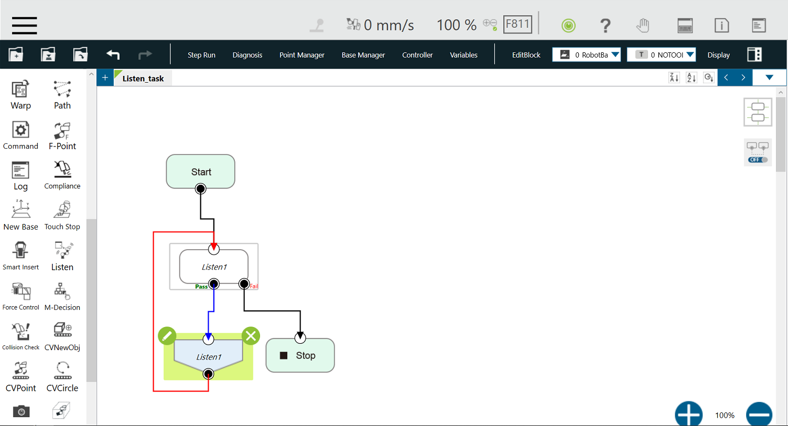
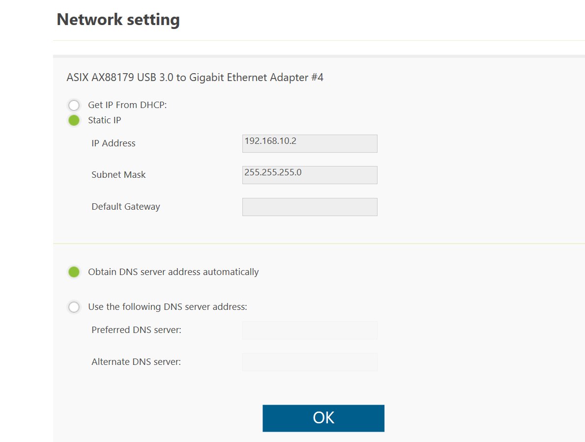
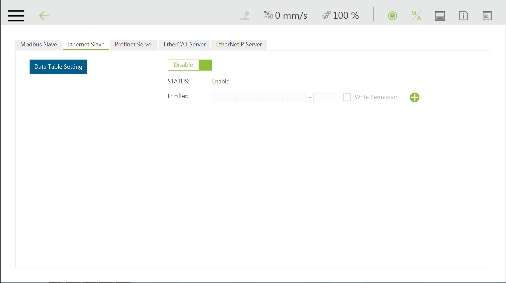
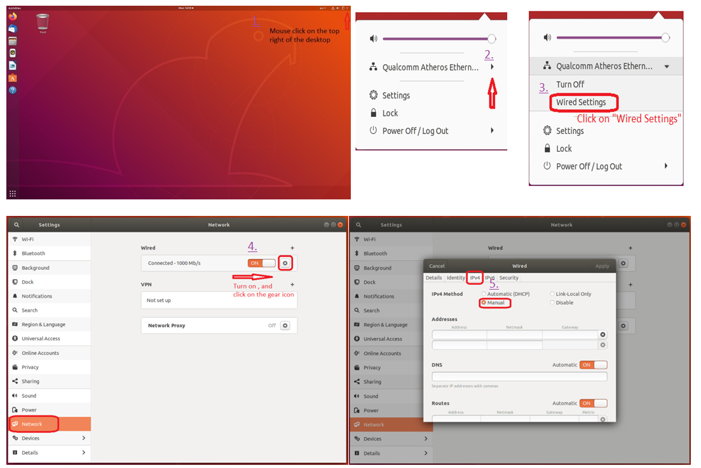
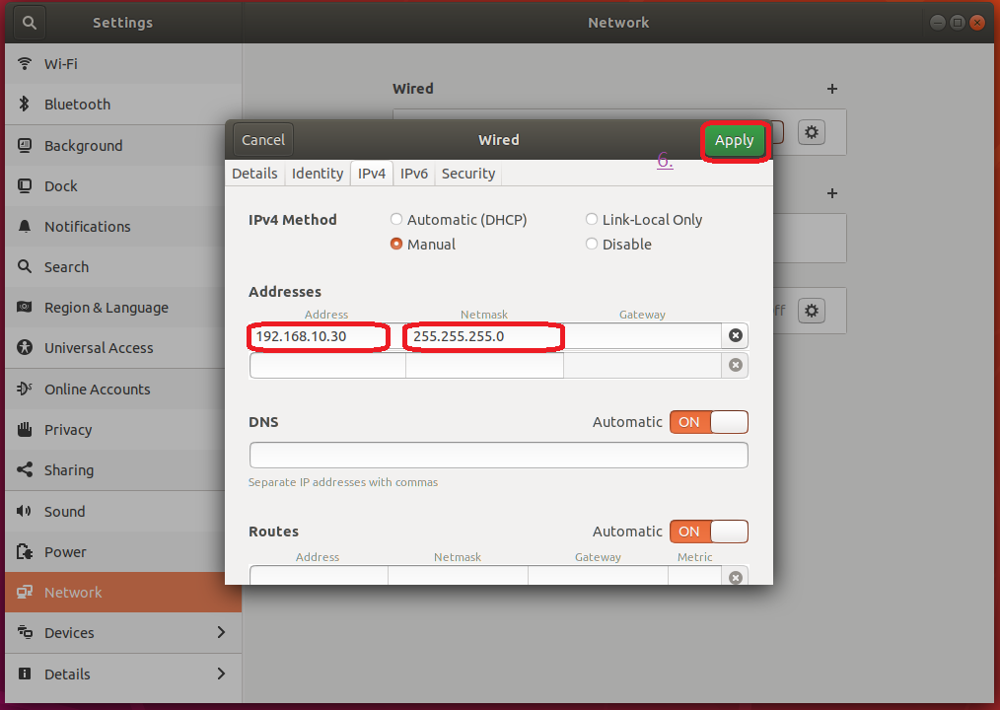
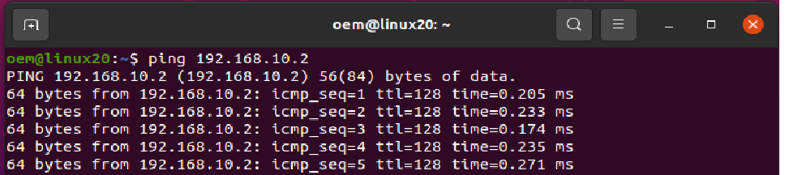

## __3. Setup Driver__

### &sect; __TMflow Listen node setup__
> The __Listen node__: a socket server can be established and be connected with ROS by an external device to communicate according to the [defined protocol](https://assets.omron.eu/downloads/manual/en/v1/i848_tm_expression_editor_and_listen_node_reference_manual_en.pdf). The user can make the robot communicate with the user's ROS (remote) computer equipment through a wired network, when all the network parameters in the _Network setting_ are set. 
>
> 1. Create a _Listen task_ of flow project of __TMflow__ software, and then drag the __Listen node__ from the _nodes menu_ onto the project flow, as shown below.
> 
>
> 2. Set the `Network` settings: mouse-click to enter the page of __System &rArr; Network__ in order.  
Example: Set the Subnet mask: 255.255.255.0 and IP address 192.168.10.2  
Note: Set the network mask, and the communication with the TM Robot must be in the set domain.  
> 
>
> 3. Set the __Ethernet Slave Data Table__ settings: mouse-click to enter the page of __Setting &rArr; Connection &rArr; Ethernet Slave__ in order.   
Enable the `Data Table Setting` item and check the following boxes as item predefined to receive/send specific data:
>
>       - [x] Robot_Error
>       - [x] Project_Run
>       - [x] Project_Pause
>       - [x] Safeguard_A
>       - [x] ESTOP
>       - [x] Camera_Light
>       - [x] Error_Code
>       - [x] Joint_Angle
>       - [x] Coord_Robot_Flange
>       - [x] Coord_Robot_Tool
>       - [x] TCP_Force
>       - [x] TCP_Force3D
>       - [x] TCP_Speed
>       - [x] TCP_Speed3D
>       - [x] Joint_Speed
>       - [x] Joint_Torque
>       - [x] Project_Speed
>       - [x] MA_Mode
>       - [x] Robot Light
>       - [x] Ctrl_DO0~DO7
>       - [x] Ctrl_DI0~DI7
>       - [x] Ctrl_AO0
>       - [x] Ctrl_AI0~AI1
>       - [x] END_DO0~DO3
>       - [x] END_DI0~DI2
>       - [x] END_AI0
>
>       
>
>    Another way to set the __Ethernet Slave Data Table__ settings is to directly import the software package , see [TM ROS Driver vs TMflow software Usage : Import Data Table Setting](https://github.com/TechmanRobotInc/TM_Export).
>  
> 4. Press the Play/Pause Button on the Robot Stick to start running this _Listen task_ project.
>
>     Note: Software TMflow version changes may have slightly different settings.([SW1.76_Rev2.00](https://www.tm-robot.com/zh-hant/wpdmdownload/software-manual-tmflow_sw1-76_rev2-00/)) ([SW1.82_Rev1.00](https://www.tm-robot.com/zh-hant/wpdmdownload/software-manual-tmflow_sw1-82_rev1-00/)) 

###  &sect; __Remote connection to TM ROBOT__
> Static IP of remote connection network settings through the wired network .  
>
> 1. Set the wired network of the user's (remote) Ubuntu computer by mouse-click on the top right of the desktop &rArr; Click on "Wired Settings" &rArr; Click on the gear icon &rArr; In the IPv4 feature options, click on "Manual" in order.  
> 
> 2. Set the Static IP settings: where the IP address is fixed for the first three yards same as the previous setting 192.168.10, last yards 3-254 machine numbers are available. (Because _TM ROBOT_, you have been set to 192.168.10.2 )  
> Example: Set the Netmask: 255.255.255.0 and IP address 192.168.10.30    
> 
> 3. Check Internet connection: start a terminal to test the connectivity with the target host _TM ROBOT_, by typing ping 192.168.10.2
> 

