## __8. Vision__

### &sect; __TM ROS Vision usage__
> Get image data through TMvision&trade; of TM Robot **(Built-in Vision System)**  
>
> __Dependencies__
>
> - ROS2 Foxy
> - Python packages:
>   1. flask
>   2. waitress
>   3. opencv-python==3.4.13.47 (Minimum)
>   4. numpy
>   5. datetime  
>
>    For example, install Python3 packages: 
>      *  pip3 install flask
>      *  pip3 install waitress
>      *  pip3 install opencv-python
>      *  pip3 install datetime
>
> __Techman Robot Vision__
>
> - type: sensor_msgs::msg::Image
> - message name: techman_image
>
> __Build TM ROS Vision driver node on your (remote) computer__
>
> Under the environment settings have been finished with your workspace`<workspace>`, then type
>
> ```bash
> cd ~/<workspace> && source install/setup.bash
> ros2 run tm_get_status image_talker
> ```
>
> <table><tr><td bgcolor=bisque> <font color=black> Note :</font><br/>The user can check whether the connection succeeds or not? When you proceed to the following steps introduced in the following text: steps 6 of § TMflow Vision node setup.</td></tr></table><br/>

### &sect; __TMflow Vision node setup__
> The __Vision node__ provides the creation of a plane with fixed-point type, servo type, and object type as well as a variety of AOI identification functions.<br/>
> :bulb: Before going through the following steps, please build the TM ROS Vision driver node on your (remote) computer and then connect this (remote) computer to the local TM Robot computer.
>
> 1. Create a _Vision task_ project of __TMflow__ software, and then drag the __Vision node__  from the _nodes menu_ onto the project flow, as shown below.<br/>
> 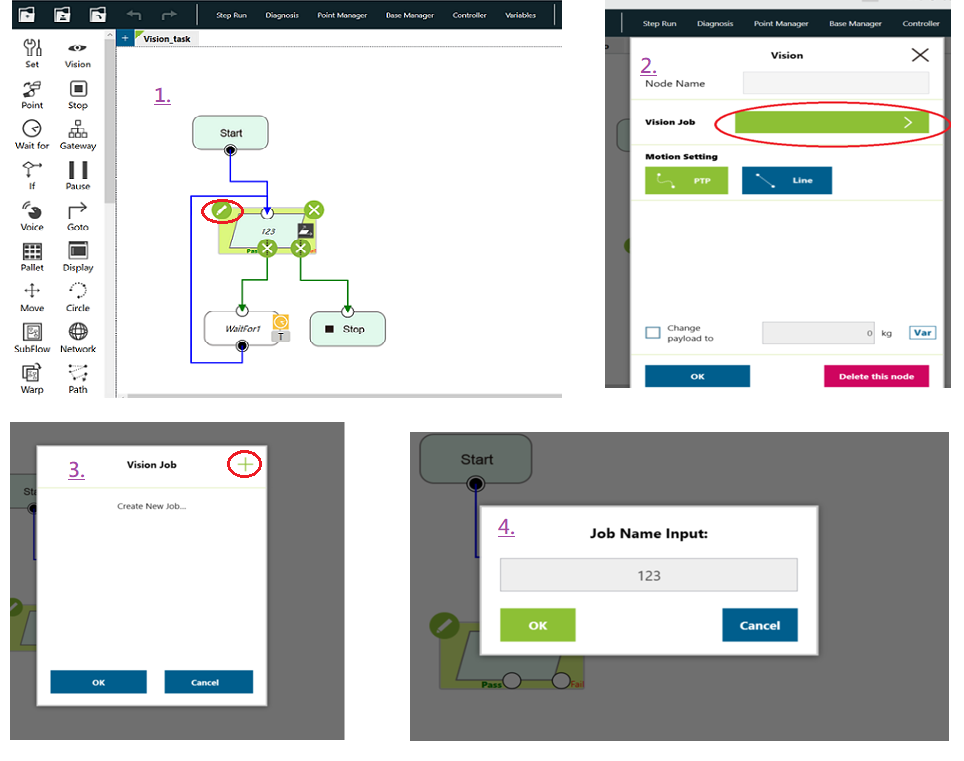
> 2. Click the __AOI -only__ icon, and then follow the steps below to handle some settings related to accessing TM Robot HMI.<br/>
> 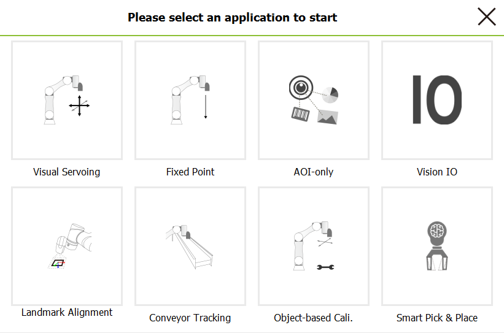
>
>    TMflow 1.76 second version only:<br/> 
> If no suitable dongle is detected, warning alerts will be displayed in the window.<br/>
> 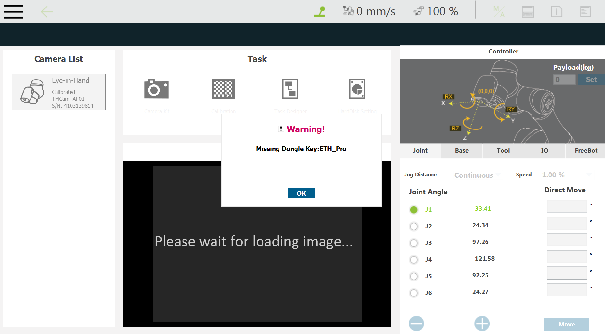
> TMflow 1.80 version: <br/>
> The user don't need dongle to activate this function.
>
> 3. Click the __Find__ icon.  bbbb
> 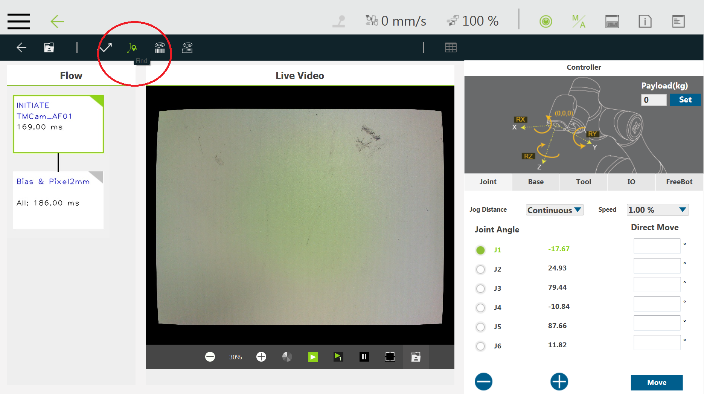
>
> 4. In TMflow 1.76 second version, click the __AI_Detection__ icon.<br/>
> 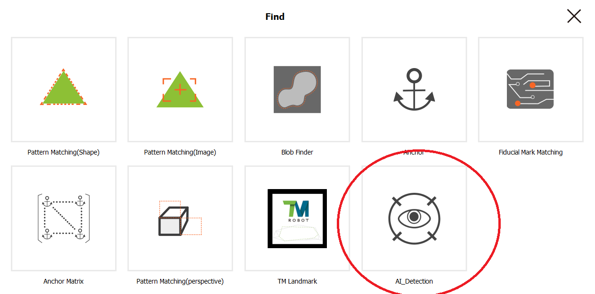
> In TMflow 1.80 version, click the __External Detection__ icon.
> 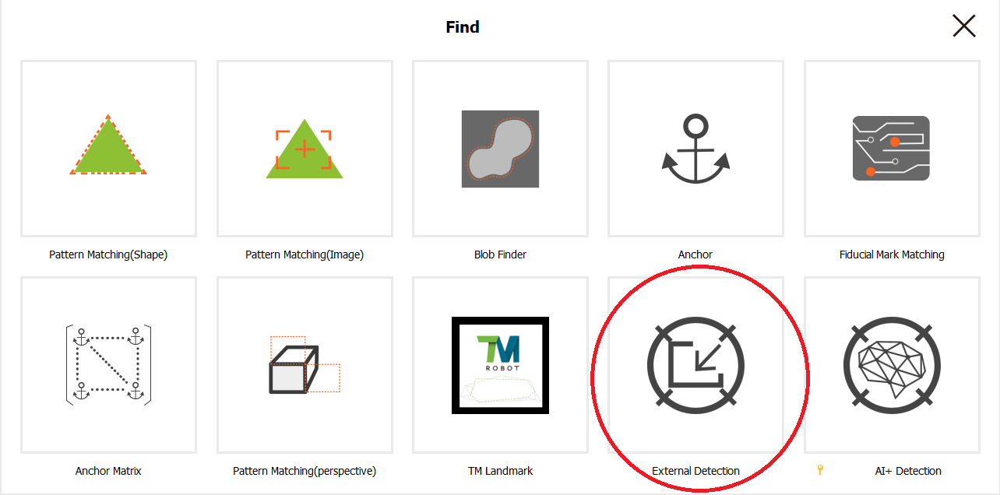
>
> 5. In TMflow 1.76 second version, click the __+ Add Parameters__ button.
> 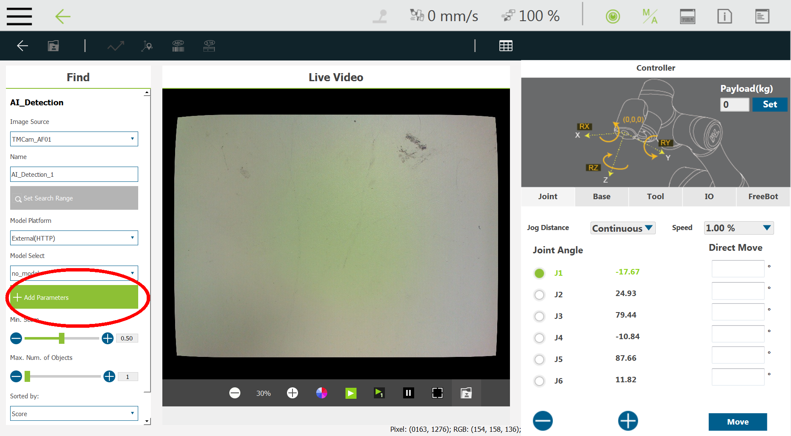
> In TMflow 1.80 version, click the __Setting__ button.
> 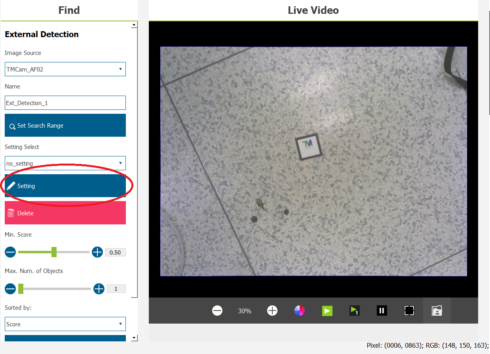
>
> 6. To check whether the connection succeeds or not, please enter ``<user_pc_ip_address>:6189/api`` in the __HTTP Parameters__ blank text and click the __Send__ button to get the information of the (remote) computer for ROS.<br/>
> The `<user_pc_ip_address>` means the IP address of the user's (remote) ROS computer, for example 192.168.2.12<br/>
> 
>
>    If the connection fails, a __TIMEOUT__ error will be displayed in the window
> 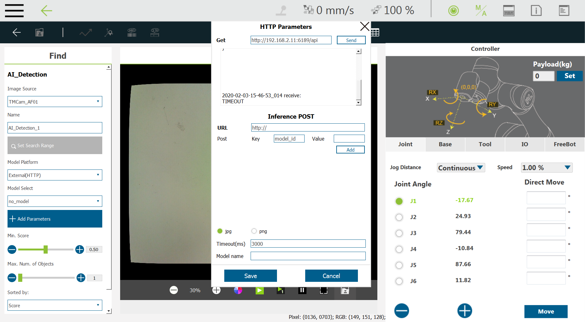
>
>    If the IP address of the user's (remote) ROS computer doesn't exist, **ERROR_CODE_7** will be displayed in the window.
> 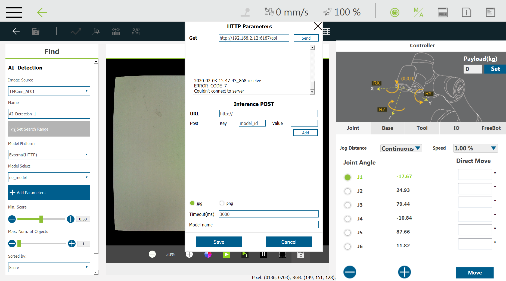
> 7. Enter ``<user_pc_ip_address>:6189/api/DET`` in the URL blank text and type arbitrary letters in the __Value__ blank text; the __Key__ will be generated automatically.
> 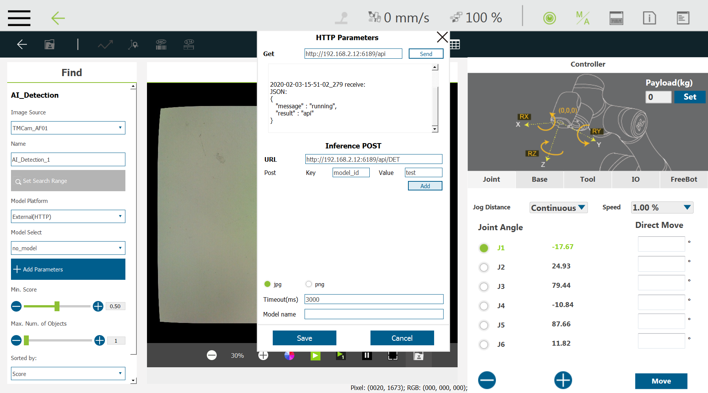
> 8. Assign a name to the model in  the __Model name__ blank text and click the __Save__ button.
> 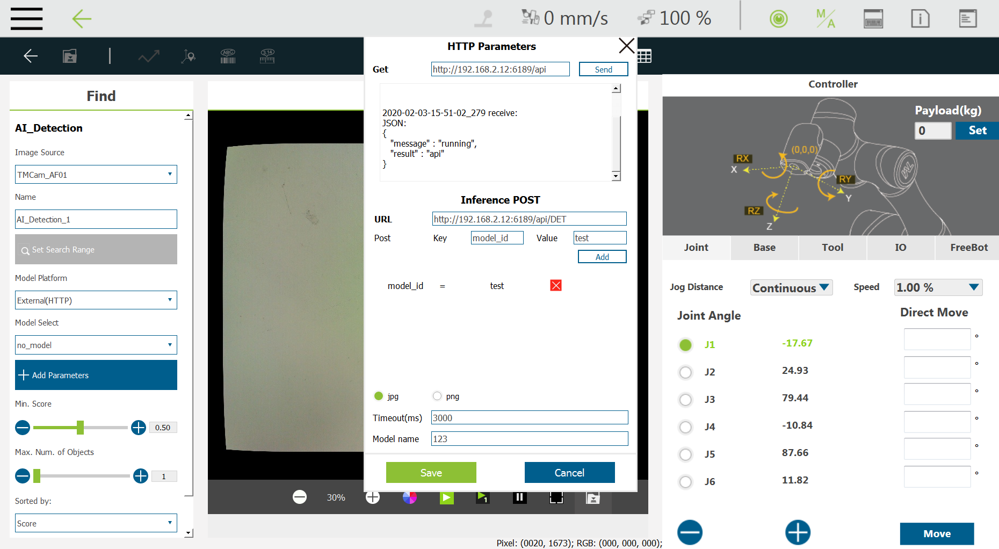
>
> 9. Press the Play/Pause Button on the Robot Stick to start running this _Vision task_ project.
>
>    Note: TMflow software version changes may have slightly different settings.([SW1.76_Rev2.00](https://www.tm-robot.com/zh-hant/wpdmdownload/software-manual-tmflow_sw1-76_rev2-00/)) ([SW1.80_Rev2.00](https://www.tm-robot.com/zh-hant/wpdmdownload/software-manual-tmflow_sw1-80_rev2-00-2/))<br/>


###  &sect; __Receive image data on the user's computer from TMflow Vision node__
> :bulb: Do you prepare the TM Robot ready ? Make sure that TM Robot's operating software (TMflow) relative __HTTP Parameters__ Vision settings are ready and the _Vision task_ project is running.<br/>
>
> Now, in a new terminal of your (remote) ROS computer : Source setup.bash in the workspace path and run to get image data from TMvision&trade; by typing
>
> ```bash
> source ./install/setup.bash
> ros2 run custom_package sub_img
> ```
>
> Then, the viewer will display image data from _TMflow_.
